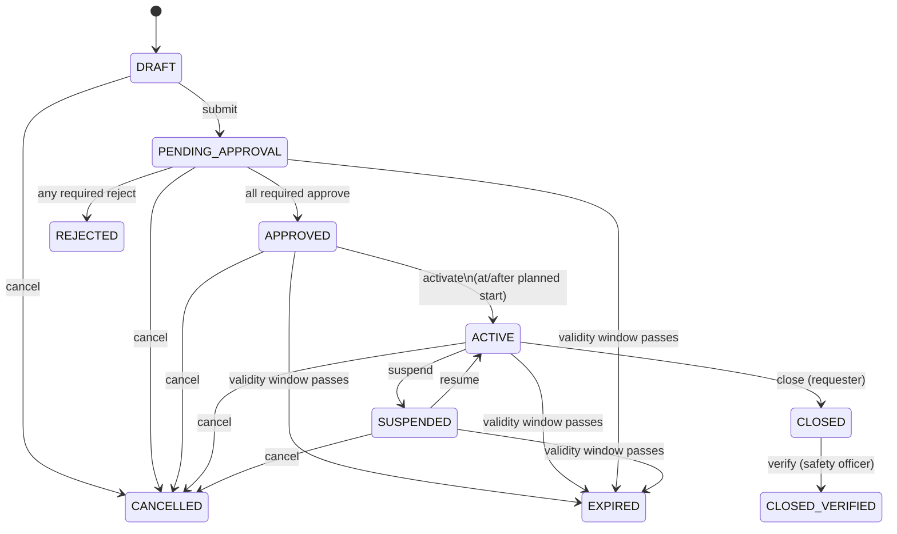

# Permit to Work (PTW) — Domain Notes

**Source of truth:** Opmaint Web Development Intern Assignment (7-page spec).
**Product context:** [opmaint.com](https://opmaint.com) — plant-oriented CMMS. Tagline: “The CMMS your plant actually uses.” Adoption is the product.
**This document’s purpose:** Interview-grade understanding of the domain, rules, and design decisions. No application code.

Where the spec is silent, this document marks a **Recommended decision**. Those are proposals, not built behaviour. Do not treat them as requirements until approved.

---

## 1. What a CMMS is

A **CMMS** (Computerized Maintenance Management System) is the software a plant uses to run maintenance instead of paper, WhatsApp, and Excel.

In simple terms it answers:

- What equipment do we have?
- What is broken, due, or about to fail?
- Who is supposed to work on it, and did they finish?
- What spares do we have?
- What did this asset cost us in downtime and repairs?

Typical CMMS objects: **plants / areas / assets**, **work orders**, **preventive schedules**, **meters** (running hours, cycles), **spare parts**, **checklists / procedures**.

Opmaint’s version of this is explicitly shop-floor software, not an office dashboard that technicians ignore. Their users are technicians, supervisors, planners, and plant managers in manufacturing, steel, chemicals, food, automotive, and similar plants. Work is raised, routed, done, photo-signed, and closed. Procedures exist for maintenance, safety, and operations.

A Permit to Work module is **not** a work order. A work order says “do this job.” A permit says “you are allowed to do this *dangerous* job, here, now, under these controls.” In a real CMMS they sit next to each other: the job may exist as a work order, but hot work / confined space / height / electrical isolation cannot start until a live permit says so.

If we build a generic ticket app and label the tickets “permits,” we have missed the product. The failure mode of this screen is not a messy backlog. It is a person getting hurt and the plant having no record of who authorized what.

---

## 2. What a Permit to Work is

A **Permit to Work (PTW)** is a formal, time-bounded authorization to perform a hazardous job.

In most Indian plants it is still a paper form. Someone fills it, someone inspects the site, the area owner and safety officer sign it, the crew works only inside the printed time window, and the permit is handed back when the job is done.

Digitizing it does not change the meaning. It changes three things the paper process is bad at:

1. **Enforcement** — a paper form cannot stop work after expiry. Software can.
2. **Record** — after an incident, investigators need who / what / when, not a smudged triplicate.
3. **Visibility** — a safety officer walking the plant should see what is live, what is expiring, and what was suspended, without hunting clipboards.

The assignment is to build that module as if it would slot into a product like Opmaint.

---

## 3. Real-world workflow of a permit

Concrete story from the spec: a contractor needs to weld a bracket onto a pipe rack.

1. **Request.** A requester (technician or contractor supervisor) describes the exact job, exact location (plant → area → equipment), and exact time window. Welding is hot work: open flame near vapour, oil residue, or a gas line.
2. **Site controls.** A safety officer inspects and lists precautions: isolate this line, test the atmosphere, keep an extinguisher and a fire watch, clear combustibles within a stated radius.
3. **Approvals.** The people who own the risk sign off. Typically:
   - the **area / production owner** who owns that equipment
   - the **safety officer**
4. **Issue / activate.** Only then may work start, and only inside the approved window. A permit for one shift is not valid the next shift.
5. **Execute under control.** Gas may be retested. A fire watch stays present. For confined space, people are logged in and out. Isolation locks stay on until the job is done.
6. **Close.** When the job is done the requester marks work complete. The area is inspected. The permit is closed and handed back.
7. **Verify.** Safety confirms the area is clean / safe and the permit is fully closed out.
8. **Interruptions.** If conditions change — gas alarm, shift handover, emergency — the permit is **suspended immediately** and work stops. If the validity window passes, it **expires**. An expired permit is dead. You raise a new one (or, if built, an explicit extension *before* expiry).

That is the lifecycle we have to model. Every status on screen should mean something a technician or safety officer would recognize on a plant floor.

---

## 4. The four permit types

All four are “dangerous work authorizations.” They differ in the *hazard physics* and therefore in the *controls that must be recorded*. Shared header, different body.

### 4.1 Hot Work

**What it is.** Any job that can ignite a fire or explosion: welding, grinding, cutting, soldering. Open flame or sparks.

**Why it exists.** Plants contain flammable vapour, oil residue, and gas lines. The weld itself may be routine. The atmosphere around it is not.

**Type-specific fields (spec):**

- Type of hot work: welding / grinding / cutting / soldering
- Fire watch assigned
- Fire extinguisher type present
- Combustibles cleared radius
- Gas test readings: LEL %, O₂ %, with test time

**What “good” looks like in the UI.** It should feel like a hot-work pad: fire watch is a named person, not a checkbox you tap by habit; gas readings have units and a timestamp; radius is a number of metres, not “yes, cleared.”

### 4.2 Confined Space Entry

**What it is.** Entry into a space not designed for continuous occupancy, with limited entry/exit: tanks, vessels, pits, sewers, silos.

**Why it exists.** People die from oxygen deficiency, toxic gas (H₂S, CO), flammable atmosphere, or nobody knowing they are inside when they collapse. The standby attendant and rescue plan are the difference between an incident and a fatality.

**Type-specific fields (spec):**

- Space ID
- Entry point
- Atmospheric test: O₂ %, LEL %, H₂S ppm, CO ppm, with test time
- Standby attendant name
- Rescue plan
- Ventilation method
- Entry/exit log

**Design note.** The entry/exit log is not a static form field. It is a live log while the permit is ACTIVE: person in, person out. That is one reason “work cannot be logged against a permit that isn’t ACTIVE” exists.

### 4.3 Working at Height

**What it is.** Work where a fall from height can kill or seriously injure.

**Why it exists.** Scaffold, ladder, MEWP (mobile elevating work platform), or rope access each fail in different ways. Fall arrest only works if the anchor is real. People below need barricading because dropped tools kill too.

**Type-specific fields (spec):**

- Height in metres
- Access method: scaffold / ladder / MEWP / rope
- Fall arrest equipment
- Anchor point checked
- Barricading below

### 4.4 Electrical / Isolation (LOTO)

**What it is.** **LOTO = Lock Out / Tag Out.** Before someone works on equipment, every energy source that could start it or shock them is isolated, locked, tagged, and proven dead.

**Why it exists.** “The machine was supposed to be off” is how electrical and mechanical isolation accidents start. The permit is the record of *which* points were isolated, *which* locks/tags were applied, whether earthing was applied, and *who* tested dead.

**Type-specific fields (spec):**

- Equipment tag
- Voltage level
- Isolation points list
- Lock numbers
- Tag numbers
- Earthing applied
- Tested dead by whom

**Design note.** Isolation points, lock numbers, and tag numbers are repeating items (one permit, many points). Model them as a list, not three comma-separated strings, even if they live in JSON.

---

## 5. The four user roles

Four roles. Enforced **server-side**. Auth may be simple (email + password, session or JWT). No OAuth.

### 5.1 Requester (technician / contractor supervisor)

- Creates permits
- Submits permits
- Closes **their own** permits (completion notes)
- Cannot approve anything
- The person holding the job, not the person authorizing risk

### 5.2 Area Owner

- Approves permits for equipment **in their area only**
- Cannot approve for other areas
- Represents production / the people who own that kit
- If they created the permit themselves, they still cannot approve it (self-approval rule)

### 5.3 Safety Officer

- Approves **any** permit
- Can **suspend any ACTIVE permit instantly**
- Performs **closure verification** (area clean / safe)
- Plant-wide safety authority, not area-scoped

### 5.4 Admin

- Full access
- Manages users, areas, equipment
- Exists so the demo and the plant can be set up without a second back office tool
- Still should not be a reason to skip self-approval tests if an admin is also the requester — **Recommended decision:** self-approval ban applies even to Admin when they are the requester of that permit. Admin may still cancel, suspend (if we allow), or manage master data.

### Shared constraint (spec, must test)

> A person can never approve their own permit, even if their role would otherwise allow it.

---

## 6. Every business rule in the assignment

Grouped so they can be turned into tests.

### 6.1 Product / modelling rules

1. Support at least four types: Hot Work, Confined Space Entry, Working at Height, Electrical / Isolation (LOTO).
2. Each type has the distinct fields listed in section 4.
3. All types share a common core: requester, contractor/team, work description, exact location (plant → area → equipment), planned start and end datetime, hazards identified, PPE required, precautions checklist, approvals, status.
4. Model a **shared permit entity with type-specific fields**. A fifth type (e.g. Excavation) must be addable without rewriting the module. This is the single biggest evaluation item.
5. Do not build four copy-pasted forms.

### 6.2 Lifecycle rules

6. Implement the specified state machine (section 7) and enforce it in the **backend**.
7. A permit cannot go `ACTIVE` unless **every** required approver has approved.
8. A permit cannot go `ACTIVE` before its planned start time.
9. A permit auto-expires when its validity window passes.
10. An expired permit can **never** be reactivated. A new permit must be raised.
11. Extension is a separate, explicitly requested action (optional feature, but the core rule still forbids silent reactivation).
12. Work cannot be logged against a permit that isn’t `ACTIVE`.
13. Any illegal transition must be rejected server-side with a **clear error**, including when the API is hit directly.

### 6.3 Role rules

14. Requester: create, submit, close own; cannot approve.
15. Area Owner: approve only for their area.
16. Safety Officer: approve any; suspend any `ACTIVE`; closure verification.
17. Admin: full access; manage users, areas, equipment.
18. No self-approval.
19. A user must never see a button they aren’t allowed to press (UI consequence of 14–18).
20. Reject requires a **mandatory reason**. Approve is “with a comment.”

### 6.4 Screen / UX rules

21. List/dashboard filterable by status, type, area, date range, and “my approvals pending.”
22. Dashboard must make obvious: what is **active right now**, and what is **expiring in the next 2 hours**.
23. Create flow is multi-step and adapts to type. Drafts must be saveable.
24. Detail shows full permit, approval trail, audit log, and legal actions for *this* user + *this* state.
25. Approval view: see what to check, approve with comment, or reject with reason.
26. Closure: requester marks complete with notes; safety officer verifies area is clean and closes it out.

### 6.5 Audit rules

27. Log every state change, approval, rejection, suspension, and field edit **after submission**.
28. Each entry is immutable: who, what, when, from-value, to-value, comment.
29. Visible on permit detail as a **readable timeline**, not a JSON dump.
30. This log is what a safety audit or incident investigation would produce.

### 6.6 Delivery / engineering rules (still business constraints for this assignment)

31. Real database, real schema. No JSON files, no in-memory arrays.
32. Schema/migrations in the repo.
33. Seed: 4 users (one per role), 2 plants, ~6 equipment items, ~10 permits across different statuses. Login and see data in under two minutes.
34. README: working setup, demo credentials for all four roles, silent decisions, what you’d build next, what you knowingly left broken, what AI was used for.
35. Tests around the state machine and permission rules (not full coverage).
36. Reasonable commit history. Not one giant commit.
37. Live deploy. If it isn’t on the internet, it doesn’t count.
38. GitHub repo public, or private with `tanzeel@opmaint.com` invited.
39. Loom 6–8 minutes, camera on: demo, one part you’re proud of, one part you’d rewrite.
40. Prefer React + TypeScript frontend and Node/TypeScript + Postgres backend (Next.js full-stack is explicitly acceptable).

### 6.7 Recommended decisions where the spec is silent

These are not in the spec. They need approval before coding.

| ID | Gap | Recommended decision |
| --- | --- | --- |
| D1 | Who are the required approvers? | Two slots on every type: **Area Owner of the permit’s area** + **any Safety Officer**. Both must approve. Admin does not replace them unless acting in that role. |
| D2 | Multiple area owners in one area | One Area Owner approval is enough (any owner of that area). Not a vote of all owners. |
| D3 | Approve comment | Optional on approve. Mandatory on reject (spec already requires the reason). |
| D4 | Who activates `APPROVED` → `ACTIVE`? | Explicit action by Requester (own permit), Safety Officer, or Admin — only at/after planned start, never before. Not auto-activated by a timer. |
| D5 | Who resumes `SUSPENDED` → `ACTIVE`? | Safety Officer or Admin. Requester cannot self-resume. |
| D6 | Who cancels? | Requester (own), Area Owner (own area), Safety Officer, Admin — and only from non-terminal states. |
| D7 | Is `CLOSED` cancellable? | **No.** Treat `CLOSED` as waiting for verification only. Legal next steps: `verify` → `CLOSED_VERIFIED`, or (if we must) Admin-only correction. Cancelling a handed-back job is the wrong real-world action. |
| D8 | Does `PENDING_APPROVAL` / `SUSPENDED` expire? | **Yes.** When `planned_end` passes, any of `PENDING_APPROVAL`, `APPROVED`, `ACTIVE`, `SUSPENDED` become `EXPIRED`. You cannot approve or resume a window that already ended. |
| D9 | Field edits after submit | After `submit`, core and type-specific fields are locked. Only Admin may patch, and every field change is audited. Requester cannot quietly edit a pending permit. |
| D10 | Rejected / expired / cancelled restart | No resurrection. Clone-as-new-draft is a later nicety, not required. |
| D11 | Work logging | A `work_log` (or type-specific log such as entry/exit, gas retest) is allowed only while `ACTIVE`. API must 409 otherwise. |
| D12 | Timezone | Store timestamps in UTC. Display in `Asia/Kolkata`. Validity comparisons use the stored instants, not the browser’s local clock. |
| D13 | Permit number | Human-readable `PTW-YYYY-NNNN` generated server-side on first save or on submit. |
| D14 | Default PPE / precautions | Each type has a default checklist (data, not hardcoded UI). User can add/remove before submit. |
| D15 | Isolation / entry-exit / gas tests | Repeating groups stored as JSON arrays validated by the type schema (good enough for 12–16h). Mention in README that a fifth type adding heavy query needs might deserve child tables. |
| D16 | Notifications | Out of scope. Stub `notify(event)` that logs “would notify X” for submit / approve / reject / suspend / expire / verify. |
| D17 | Attachments | URL field only, no upload. |
| D18 | Self-approval vs Admin | If `approver_id === requester_id`, reject even for Admin and Safety Officer. |

---

## 7. Permit lifecycle as a state machine

### 7.1 States

| State | Meaning on the plant | Terminal? |
| --- | --- | --- |
| `DRAFT` | Form being filled. Not submitted. Not a live authorization. | No |
| `PENDING_APPROVAL` | Submitted. Waiting for required approvers. | No |
| `APPROVED` | Every required approver signed. Work still must not start until activation and start time. | No |
| `ACTIVE` | Issued and live. This is the only state in which work may be logged. | No |
| `SUSPENDED` | Conditions changed. Work must stop *now*. Permit is not dead; it can be resumed. | No |
| `REJECTED` | Any required approver refused. Dead. | **Yes** |
| `EXPIRED` | Validity window passed. Dead. New permit required. | **Yes** |
| `CLOSED` | Requester says the job is done. Area not yet verified by safety. | No (waiting verify) |
| `CLOSED_VERIFIED` | Safety has verified the area. Fully closed out. | **Yes** |
| `CANCELLED` | Withdrawn before completion. Dead. | **Yes** |

### 7.2 Diagram



`REJECTED`, `EXPIRED`, `CLOSED_VERIFIED`, `CANCELLED` have no outbound arrows.

The dashed line in the spec (“any non-terminal → CANCELLED”) is implemented as the cancel arrows above, **except `CLOSED`** per D7.

---

## 8. Legal vs illegal transitions

Let `S` be the current status. Only the listed `(from, action, to)` triples are legal, and only if extra guards pass.

### 8.1 Legal transitions

| From | Action | To | Extra guards |
| --- | --- | --- | --- |
| `DRAFT` | `submit` | `PENDING_APPROVAL` | Caller is requester (or Admin). Required core + type fields valid. Planned end > planned start. End not already in the past. |
| `PENDING_APPROVAL` | `approve` | `PENDING_APPROVAL` or `APPROVED` | Caller is a required approver, not the requester, and (if Area Owner) owns the area. If this approval fills the last required slot → `APPROVED`, else stay `PENDING_APPROVAL`. |
| `PENDING_APPROVAL` | `reject` | `REJECTED` | Same eligibility as approve. Reason mandatory. One rejection is enough. |
| `APPROVED` | `activate` | `ACTIVE` | All required approvals present (invariant). `now >= planned_start`. `now < planned_end`. |
| `ACTIVE` | `suspend` | `SUSPENDED` | Caller is Safety Officer or Admin. |
| `SUSPENDED` | `resume` | `ACTIVE` | Caller is Safety Officer or Admin. `now < planned_end`. |
| `ACTIVE` | `close` | `CLOSED` | Caller is the requester of this permit (or Admin). |
| `CLOSED` | `verify` | `CLOSED_VERIFIED` | Caller is Safety Officer or Admin. |
| `DRAFT`, `PENDING_APPROVAL`, `APPROVED`, `ACTIVE`, `SUSPENDED` | `cancel` | `CANCELLED` | Role-allowed (D6). |
| `PENDING_APPROVAL`, `APPROVED`, `ACTIVE`, `SUSPENDED` | `expire` (system) | `EXPIRED` | `now >= planned_end`. System actor, not a user button. |

`approve` is a transition of the *approval record* that *may* also transition the permit. That distinction matters in code: do not let `POST /permits/:id/approve` set `status = APPROVED` unless the last required slot just filled.

### 8.2 Illegal transitions (must 409/403 from the API)

Non-exhaustive, but these are the ones an evaluator will try.

| Attempt | Why illegal |
| --- | --- |
| `DRAFT` → `ACTIVE` / `APPROVED` | Skips submit and approvals. |
| `PENDING_APPROVAL` → `ACTIVE` | Skips “all approve” and activate. |
| `APPROVED` → `ACTIVE` before `planned_start` | Spec: cannot go ACTIVE before planned start. |
| `APPROVED` → `ACTIVE` with a missing approver | Should be unreachable if `APPROVED` is honest; still guard it. |
| Any → `ACTIVE` after `planned_end` | Window is dead; must expire, not activate. |
| `EXPIRED` → `ACTIVE` / `APPROVED` / `SUSPENDED` | “Never reactivated.” |
| `REJECTED` → anything | Terminal. |
| `CANCELLED` → anything | Terminal. |
| `CLOSED_VERIFIED` → anything | Terminal. |
| `SUSPENDED` → `CLOSED` | Spec only allows resume from suspended. Close happens from `ACTIVE` (work is being done). If the job is abandoned, `cancel`. |
| `ACTIVE` → `CLOSED_VERIFIED` | Skips requester close + safety verify. |
| `DRAFT` → `CLOSED` | Nothing was authorized or done under a permit. |
| `approve` by requester | Requesters cannot approve. |
| `approve` by the same user as `requester_id` | Self-approval ban, all roles. |
| `approve` by Area Owner of a different area | Area scope. |
| `approve` / `reject` when not `PENDING_APPROVAL` | Wrong state. |
| `suspend` when not `ACTIVE` | Spec: suspend any ACTIVE permit. |
| `resume` when not `SUSPENDED` | |
| `resume` after `planned_end` | Should expire, not resume. |
| `close` by a requester who does not own the permit | “Closes their own permits.” |
| `verify` by Requester or Area Owner | Safety Officer (or Admin) only. |
| `log_work` in any state other than `ACTIVE` | Including `SUSPENDED`, `APPROVED`, `CLOSED`. |
| `submit` with invalid type payload | Type schema must fail server-side. |
| Mutating a terminal permit’s fields | Locked. |

HTTP shape **Recommended decision:** `401` unauthenticated, `403` authenticated but wrong role/person/area, `409` wrong state / illegal transition, `422` validation (missing reason, bad gas reading, end before start). Message body includes `code` + human `message` so the UI and the evaluator both understand it.

---

## 9. Why the state machine must be enforced on the backend

Three reasons, in the order the evaluator cares about them.

1. **They will bypass the UI.** The spec says it twice: “We will try” and “Frontend-only validation. We will bypass it.” A hidden button is not a control. `curl` with a JWT is.
2. **Safety-critical invariant.** The plant’s legal record is the database, not React state. If a permit can be forced `ACTIVE` without signatures, the module has failed its only job.
3. **30% of the score is this.** “Data model and state machine — are the rules enforced server-side? Can we break it by hitting the API directly?”

Implementation implication: one domain function, e.g. `transition(permit, action, actor)`, used by every route. The UI asks “what may I do?” from the same rules (`availableActions(permit, actor)`). Do not duplicate the graph in frontend conditionals as the source of truth.

Expiry must also be server-side. A countdown in the browser does not expire a permit when nobody has the tab open (see section 16).

---

## 10. Entities we probably need in PostgreSQL

Minimum set that can carry the spec without four permit tables.

### 10.1 Identity and plant master data

- **users** — id, name, email, password hash, role, active flag, timestamps
- **plants** — id, name, code
- **areas** — id, plant_id, name, code
- **area_owners** — area_id, user_id (Area Owner may own more than one area)
- **equipment** — id, area_id, name, tag, type/description

### 10.2 Permit core

- **permits** — shared header (see section 12 for JSONB vs columns)
  - id, permit_no, type, status
  - requester_id, contractor_team
  - description
  - plant_id, area_id, equipment_id (denormalise plant/area so list filters stay simple even if equipment moves later)
  - planned_start, planned_end, activated_at, closed_at, verified_at, expired_at, cancelled_at
  - hazards (json/text array), ppe (json), precautions (json)
  - type_data (jsonb) — type-specific payload
  - attachment_url (optional)
  - created_at, updated_at
  - version/row lock if we want optimistic concurrency on transitions

### 10.3 Approvals, work, audit

- **permit_approvals** — permit_id, slot (`AREA_OWNER` \| `SAFETY_OFFICER`), required_role, assigned_area_id (for area slot), approver_id nullable until acted, decision (`PENDING` \| `APPROVED` \| `REJECTED`), comment, decided_at, signature_data optional
- **permit_work_logs** — permit_id, actor_id, kind (`NOTE` \| `GAS_RETEST` \| `ENTRY` \| `EXIT` \| …), payload jsonb, created_at
- **audit_events** — id, permit_id, actor_id (nullable for system expiry), action, from_status, to_status, field_name nullable, from_value, to_value, comment, created_at. **Insert-only.**

### 10.4 Optional if we build the “good vs average” items

- **permit_extensions** — permit_id, requested_hours, previous_end, new_end, status, requested_by, decided_by, reason
- **permit_conflicts** — or compute on the fly; no table required for v1

### 10.5 What we do *not* need

- Four tables `hot_work_permits`, `confined_space_permits`, …
- Tenants, billing, notification queue, file blobs, websocket channels

---

## 11. Relationships

```text
plants 1 ── * areas 1 ── * equipment
                │
                └── * area_owners * ── 1 users

users 1 ── * permits (as requester)
users 1 ── * permit_approvals (as approver)
users 1 ── * audit_events (as actor)
users 1 ── * permit_work_logs (as actor)

permits * ── 1 plants
permits * ── 1 areas
permits * ── 1 equipment
permits 1 ── * permit_approvals
permits 1 ── * permit_work_logs
permits 1 ── * audit_events
permits 1 ── * permit_extensions (optional)
```

**Location path:** every permit points at equipment, which already belongs to an area of a plant. We still store `plant_id` and `area_id` on the permit as the location *at the time of the job*. That is what was authorized. If master data is later reorganised, the permit must not change location.

**Area Owner scope:** authorization is `user → area_owners → areas`. An approve call loads the permit’s `area_id` and checks membership. Safety Officer skips this check. Requester never gets an approval row they can complete.

**Approval slots:** a permit in `PENDING_APPROVAL` has two (or N) `permit_approvals` rows created at submit time. The permit status is a *projection* of those rows plus the state machine, not a free-floating enum someone PATCHes.

---

## 12. Modelling four types without four tables or four forms

This is the design they said they are evaluating most.

### 12.1 What juniors do (do not do this)

- `HotWorkForm.tsx`, `ConfinedSpaceForm.tsx`, `HeightForm.tsx`, `ElectricalForm.tsx`
- `hot_work_permits`, `confined_space_permits`, …
- Copy-paste validation

Adding Excavation then means a fifth form, a fifth table, a fifth set of routes. The spec calls this out by name.

### 12.2 Recommended model: core row + type registry + JSONB payload

Three layers, one of which is data.

1. **Relational core** (`permits`) holds everything we filter, enforce, and join: type, status, people, location, window, shared hazards/PPE/precautions.
2. **Type registry in code** (single module, e.g. `permitTypes.ts`) declares, for each type:
   - id (`HOT_WORK`, …)
   - label
   - field schema (name, input kind, required, min/max, units, options)
   - default PPE / precautions
   - required approval slots (same two for v1, but *declared* per type so Excavation could add e.g. Civil Owner later)
   - validation function
3. **`permits.type_data JSONB`** stores the type-specific answers. On write, the server validates `type_data` against the registry for `permits.type`. Unknown keys rejected. Missing required keys rejected.

Frontend **Create** and **Detail** screens are schema-driven: they render the shared steps, then render fields from `GET /permit-types/:type/schema`. No per-type page components except maybe small widgets (gas reading group, isolation-point repeater, entry/exit log).

Adding Excavation:

- Register `EXCAVATION` in the type registry with its fields (depth, shoring, underground services checked, …).
- Seed a couple of rows.
- No new table, no new form route, no new status graph.

### 12.3 Why not four child tables?

Child tables (`permit_hot_work`, …) are more typed and easier to query, but adding a type still requires a migration + Prisma model + form. That fights the “fifth type without rewriting anything” requirement. JSONB + a registry is the honest 12–16 hour answer, if we keep the registry strict.

### 12.4 Why not one giant table with every column nullable?

`welding_type`, `space_id`, `height_m`, `voltage`, … on one row. It works until type 5, then the table becomes a junk drawer and every query has to know which columns matter. The registry + JSONB keeps the relational surface stable.

### 12.5 TypeScript shape

Use a discriminated union *in the application layer* (`type: 'HOT_WORK', typeData: HotWorkData`) even though the database is JSONB. The DB is flexible; the domain layer is not.

---

## 13. RBAC rules

Server checks **role ∧ resource ∧ state**. UI hides illegal actions using the same helper.

| Action | Requester | Area Owner | Safety Officer | Admin |
| --- | --- | --- | --- | --- |
| Create / save draft | Yes | Yes (if we allow any user to raise; **Recommended:** any authenticated user may create, but seed Requester as the one who does) | Yes | Yes |
| Submit own draft | Own | Own | Own | Own |
| Submit others’ drafts | No | No | No | Yes |
| Approve | **Never** | Own **area**, not own permit | Any, not own permit | **Recommended:** No, unless we treat Admin as override. Safer for tests: Admin also cannot self-approve; Admin may still not occupy the Area Owner slot unless they are an area owner. Prefer Admin as master-data role, not a third approver. |
| Reject | Never | Same as approve | Same as approve | Same as approve |
| Activate | Own | No | Yes | Yes |
| Suspend | No | No | Yes (ACTIVE) | Yes |
| Resume | No | No | Yes | Yes |
| Log work | Own + ACTIVE | No | Yes + ACTIVE | Yes + ACTIVE |
| Close | **Own only** | No | No | Yes |
| Verify | No | No | Yes | Yes |
| Cancel | Own, non-terminal except CLOSED | Own area, same states | Yes | Yes |
| Edit after submit | No | No | No | Yes, audited |
| Manage users / areas / equipment | No | No | No | Yes |
| See list | Own + (optional: area visibility) | Own areas | All | All |
| See detail | If listed | If listed | All | All |

**Recommended list visibility (D19):** Requesters see permits they created. Area Owners see permits in their areas. Safety Officer and Admin see all. “My approvals pending” = `permit_approvals` rows where slot matches me and decision is `PENDING`.

Always-on predicates:

- `actor.id !== permit.requester_id` for approve/reject
- Area Owner: `actor.areas.contains(permit.area_id)`
- State must allow the action (section 8)

---

## 14. Approval model

This is not a single “approved_by” column. It is a small workflow of its own.

### 14.1 What “all approve” means

On `submit`:

1. Validate core + `type_data`.
2. Create two `permit_approvals` rows (D1):
   - slot `AREA_OWNER`, scoped to `permit.area_id`
   - slot `SAFETY_OFFICER`, unscoped
3. Set status `PENDING_APPROVAL`.
4. Audit `submit`.
5. Stub-notify both roles.

On `approve`:

1. Load permit. Must be `PENDING_APPROVAL`.
2. Identify which slot this actor may fill (area match vs safety role).
3. Refuse if `actor.id === permit.requester_id`.
4. Refuse if that slot is already decided.
5. Write decision `APPROVED`, comment optional, timestamp.
6. If **every required slot** is `APPROVED` → permit becomes `APPROVED`. Else remain `PENDING_APPROVAL`.
7. Audit.

On `reject`:

1. Same eligibility.
2. Reason required.
3. That slot `REJECTED`. Permit becomes `REJECTED` immediately (“any reject”). Remaining pending slots are left as `PENDING` (historical truth) or marked `CANCELLED` — **Recommended:** leave them; the permit status is the source of “this job is dead.”
4. Audit.

### 14.2 Parallel, not sequential

The spec does not require Area Owner before Safety Officer. Real plants often collect both in either order. Parallel is simpler and matches “all approve.”

### 14.3 Why Area Owner is scoped and Safety is not

Area Owner is saying “I own this kit and I accept this job in my area.” They must not sign another shop’s permit. Safety Officer is saying “the controls are adequate.” That authority is plant-wide in this spec.

### 14.4 Activate is not an approval

`APPROVED` means signatures exist. `ACTIVE` means the window has opened and someone has issued the permit for work. Splitting them is correct: you can have overnight approval for a 06:00 job without the permit being live at 23:00.

---

## 15. Audit trail

### 15.1 What gets logged

| Event | `what` | from / to |
| --- | --- | --- |
| Create draft | `CREATE` | — |
| Field change while DRAFT | **Recommended:** skip, or sample. Spec requires field edits *after submission*. | |
| Submit / approve / reject / activate / suspend / resume / close / verify / cancel / expire | State (and approval) actions | statuses |
| Field edit after submission | `FIELD_EDIT` | per-field old/new |
| Work log | `WORK_LOG` | — |
| Extension request / decision (if built) | `EXTENSION_*` | old end / new end |

### 15.2 Row shape

`who` (user id + denormalised name/role at the time), `what` (action enum), `when` (timestamptz), `from_value`, `to_value`, `comment`.

For state changes, from/to are statuses. For field edits, from/to are JSON-serialised scalars. For approvals, comment carries the approval note / rejection reason.

### 15.3 Immutability

No `UPDATE` or `DELETE` on `audit_events` from application code. No “fix the log” endpoint. If a mistake is made, a compensating action is logged (e.g. suspend, cancel).

### 15.4 UI

Permit detail: a vertical timeline in plain language.

> 14:32 — Priya (Safety Officer) approved. “Gas test acceptable, fire watch briefed.”
> 14:40 — Karthik (Requester) activated.
> 16:05 — System expired the permit (window ended 16:00).

Not a JSON blob, not only `status: ACTIVE`.

This is what gets produced in a safety audit or incident investigation. If it is incomplete, the module is not a PTW module.

---

## 16. Expiry and suspension

### 16.1 Expiry

**Trigger:** `now >= planned_end` (and, if we later add extensions, `now >= current_valid_until`).

**From:** `PENDING_APPROVAL`, `APPROVED`, `ACTIVE`, `SUSPENDED` (D8).

**To:** `EXPIRED`. Terminal. No resume, no activate, no close-as-success. Raise a new permit.

**Why “one shift is not the next shift.”** Conditions, crews, and atmosphere change. Yesterday’s signature is not today’s authorization.

**Must work when nobody has the browser open.** Options:

| Approach | Pros | Cons |
| --- | --- | --- |
| Lazy expiry: every read/write runs `expireIfDue()` | No worker, always correct on API hit | Dashboard stays stale until something reads it |
| Periodic job (every 60s) plus lazy expiry | Dashboard/API both catch up; evaluator can wait a minute | Needs a clock process (or a cron endpoint) |
| Only frontend timer | Easy | **Fails the spec** |

**Recommended:** lazy expiry on every permit load/list **plus** a lightweight interval (Node `setInterval` on the server, or a Vercel/Render cron hitting `POST /internal/expire`). List endpoint should return already-expired rows as `EXPIRED`, not `ACTIVE` with a red badge.

**“Expiring soon”:** `status === ACTIVE` (or `APPROVED`) and `planned_end - now <= 2 hours` and `planned_end > now`. First-class filter and dashboard strip. Optional: a derived label `EXPIRING_SOON` in the API that is **not** a real state (do not add it to the state machine; it is a view).

**Countdown:** show on ACTIVE detail. Cosmetic. The job/lazy path is the real control.

### 16.2 Suspension

**Who:** Safety Officer (and Admin). **When:** `ACTIVE` only. **Speed:** instant — one API call, no second approval.

**Meaning:** stop work now. Gas alarm, emergency, shift issue, unsafe condition.

**Resume:** back to `ACTIVE` if still inside the window (D5, D8). Not a new permit. Audit both ways.

**While suspended:** no work logs. UI should shout STOP, not look like a paused to-do.

### 16.3 Extension (optional, but expiry rules mention it)

Requester asks for +N hours **before** expiry. Safety Officer re-approves. Cap N (e.g. max +4 hours, max 1 extension). Logged. Does **not** allow resurrecting `EXPIRED`.

---

## 17. What the evaluator is likely to test by calling the API

Assume they have seed credentials for all four roles and maybe a fifth throwaway user.

### Auth and RBAC

- No token → 401 on mutating routes
- Requester `POST /permits/:id/approve` → 403
- Safety Officer approves a permit they themselves created → 403 (self-approval)
- Area Owner of Plant A / Area 1 approves a permit in Area 2 → 403
- Requester closes someone else’s permit → 403
- Requester hits `POST /admin/users` → 403

### State machine

- `PATCH` status directly to `ACTIVE` if such a route exists → should not exist; if it does, must still run guards
- `POST /permits/:draftId/activate` → 409
- `POST /permits/:pendingId/activate` → 409
- Approve only Area Owner, then activate → 409
- Activate an `APPROVED` permit with `planned_start` in the future → 409
- Expire (or backdate `planned_end` via admin/seed), then activate/resume → 409
- `POST /permits/:expiredId/resume` → 409
- Log work on `DRAFT`, `APPROVED`, `SUSPENDED`, `CLOSED` → 409
- Reject, then approve → 409
- Cancel a `CLOSED_VERIFIED` permit → 409
- Close from `SUSPENDED` → 409

### Validation

- Submit Hot Work without LEL / fire watch → 422
- Reject with empty reason → 422
- Confined space without standby attendant / rescue plan → 422
- End datetime before start → 422
- Wrong shape `type_data` for the declared type → 422
- `type: EXCAVATION` if not registered → 422

### Audit

- After a successful approve, GET detail includes a timeline row with who/when/comment
- After an illegal call, **no** status change and no fake audit success

They do not need a browser for any of this. If the UI is pretty and these fail, the score collapses on the 30% bucket.

---

## 18. Core vs optional vs out of scope

### 18.1 Core requirements (must ship)

- Four permit types, shared entity, type-specific fields via a registry (not four apps)
- Full state machine, backend-enforced
- Four roles, server-side RBAC, no self-approval, area-scoped Area Owner
- Email/password auth
- Screens: list/dashboard, create (multi-step, saveable draft), detail, approval, closure
- Filters: status, type, area, date range, my pending approvals
- Dashboard: active now + expiring within 2 hours
- Immutable audit timeline on detail
- Actions hidden if illegal
- Postgres + migrations + seed (4 users, 2 plants, ~6 equipment, ~10 permits)
- Tests for state machine + permissions
- README as specified, including AI usage
- Incremental commits
- Live deploy
- Loom

### 18.2 Optional (“bits that separate good from average,” spec order)

1. Expiry that actually works without an open browser; countdown; expiring-soon
2. Extension request flow (capped, SO re-approval, logged)
3. Conflict detection: overlapping hot work + confined space, same time and location
4. Mobile-first permit view (gloves, sunlight, one-handed)
5. QR code per permit
6. Canvas digital signature on approval

Do these **after** core is deployed and seeded. Optional work that delays deploy hurts the 20% “does it actually work” score.

### 18.3 Explicitly out of scope (building these costs time and earns nothing)

- Offline sync
- WebSockets / live multi-user updates
- Email / SMS / push (a stub log is encouraged)
- File/photo uploads (URL field is enough)
- Multi-tenancy, billing, org onboarding
- A pretty marketing landing page for the module

---

## 19. Technical risks

Ranked by how much they can sink a 12–16 hour build or the interview.

1. **Four duplicated types.** Highest product risk. If the abstraction is weak, 30% is gone even if CRUD works.
2. **Frontend-only rules.** Highest evaluation risk. One `curl` and the submission looks junior.
3. **Expiry without a server clock.** Easy to demo in the UI and fail the “nobody has the browser open” bar.
4. **Timezones.** Local `datetime-local` fields vs UTC storage. A permit that expires at 16:00 IST must not expire at 16:00 UTC.
5. **Self-approval + dual-role users.** Seed data that makes the Safety Officer also the requester of a permit will fail tests unless the rule is applied mechanically.
6. **Area Owner as a global approver by accident.** Forgetting the join table and checking `role === AREA_OWNER` only.
7. **Status as a writable column.** A generic `PATCH /permits/:id { status }` is an illegal-transition machine. Status changes only through action endpoints.
8. **JSONB as unvalidated blob.** Then the “fifth type” story is fake: we accepted anything. Registry validation is the abstraction.
9. **Deploy + Postgres.** Vercel-only with SQLite, or a README that needs a local Docker the evaluator will not run, fails “live and seeded.”
10. **Scope greed.** Conflict detection, QR, signatures, and a marketing page instead of a working close-and-verify path.
11. **Seed too clean.** All drafts, or all one type, or all one area. They need to click around and see ACTIVE, expiring, pending, rejected.
12. **Entry/exit and isolation lists as comma-separated strings.** Weak domain understanding (20% UI/domain bucket).
13. **Optimistic UI vs stale status.** Two approvers; second approve must see the first. No websockets required — just re-fetch on action. Spec forbids spending time on live updates.
14. **Tests that only test the frontend.** Worthless against the stated evaluation method.

---

## 20. Recommended implementation order (12–16 hours)

Follow the score: model and machine first, deploy a seeded system before polish, UI that looks like a plant permit, then one optional if time.

### Hour 0–1 — Setup, not features

- Next.js (App Router) + TypeScript + Prisma + Postgres (Neon or Railway)
- Auth: email/password + JWT or session cookies
- Repo structure: `permitTypes` registry stub, `transition` stub, empty seed
- First commits: scaffold, schema v0, README skeleton with credentials placeholders
- Copy this file; keep committing as work happens

### Hour 1–3 — Schema, seed, login

- Tables in section 10
- Migrations in repo
- Seed: 4 users, 2 plants, ≥6 equipment, 10 permits in mixed statuses (include one ACTIVE ending within 2 hours, one PENDING, one REJECTED, one EXPIRED, one CLOSED waiting verify)
- Login as each role
- **Deploy a hello-world + seed as soon as login works** so deploy is not hour 15

### Hour 3–6 — Domain core (the 30%)

- Type registry for all four types + JSON schema validation
- `transition(permit, action, actor)` with the matrix in section 8
- Action routes only: `submit`, `approve`, `reject`, `activate`, `suspend`, `resume`, `close`, `verify`, `cancel`
- No generic status PATCH
- Tests: legal paths + the illegal list in 8.2 and 17
- Audit writer used by every transition

### Hour 6–8 — RBAC + approvals

- Slot creation on submit
- Area-scope + self-approval tests
- `availableActions` API for the UI
- Work-log endpoint guarded by `ACTIVE`

### Hour 8–10 — List, filters, expiry

- List filters including `my_pending_approvals`
- `expireIfDue` on read + interval/cron
- Dashboard payloads: `activeNow`, `expiringWithin2h`

### Hour 10–13 — UI (the 20% domain bucket)

- Multi-step create: type → location/window → hazards/PPE → type-specific schema fields → review. Save draft any step.
- Detail: looks like a permit, not a SaaS invoice. Big status. Validity window. Location path. Type body. Approval stamps. Timeline. Actions that exist only if allowed.
- Approval view: what to check, comment, mandatory reject reason.
- Closure + verify.
- High contrast, large tap targets (this is already most of “mobile-first”).

### Hour 13–14 — Harden

- Error messages an evaluator can read
- Fix seed so every role has something to do in two minutes
- README: setup on a clean machine, credentials, silent decisions (section 6.7), known gaps, AI usage, next steps
- Confirm deploy against the seeded cloud DB

### Hour 14–16 — Only if core is live

Priority if extra time:

1. Real expiry job + countdown + expiring-soon (often already half-done)
2. Hot work vs confined space overlap warning
3. Extension flow
4. QR on detail
5. Signature canvas

Stop before optional work if README, tests, or deploy are weak.

### What to be proud of in the Loom vs what to rewrite

- **Proud of:** type registry + one state machine used by API and buttons; a timeline that reads like an investigation log.
- **Rewrite later:** JSONB repeating groups into child tables; a proper worker instead of lazy expiry; conflict detection as a first-class engine.

---

## Evaluation map (why this order)

| Weight | They score | We protect it by |
| --- | --- | --- |
| 30% | Data model + state machine, API-proof rules | Registry, action endpoints, tests, no status PATCH |
| 20% | Deployed, seeded, no dead ends | Early deploy, mixed seed, happy paths for all four roles |
| 20% | Domain understanding in the UI | Permit language, type-specific controls, expiry/suspend visible, not generic CRUD |
| 15% | Code quality | One transition module, clear names, boring structure |
| 15% | Loom + README | Honest decisions, known broken, AI section, camera demo of approve / suspend / expire / illegal API call |

---

## Appendix A — Suggested seed story (for a believable demo)

Two plants, e.g. **Chennai Rolling Mill** and **Hosur Packaging**. Areas: Furnace Bay, Pipe Rack, Substation, Tank Farm. Equipment: pipe rack segment, welding bay, solvent tank, MCC panel, cooling tower, silo roof.

Permits spread across types **and** statuses so each login has a job:

- Requester: a DRAFT to finish, an ACTIVE to close, a PENDING they must not be able to approve
- Area Owner: a pending permit in their area, a pending permit in the other area (must 403)
- Safety Officer: a pending approve, an ACTIVE to suspend, a CLOSED to verify
- Admin: user/area/equipment management plus a backdated permit that should show EXPIRED after expiry runs

One ACTIVE hot work ending within two hours so the dashboard is not empty.

---

## Appendix B — Glossary

| Term | Meaning |
| --- | --- |
| CMMS | Computerized Maintenance Management System |
| PTW | Permit to Work |
| LOTO | Lock Out / Tag Out — isolate energy, lock, tag, prove dead |
| LEL | Lower Explosive Limit — % of a flammable atmosphere |
| MEWP | Mobile Elevating Work Platform (cherry picker / scissor lift) |
| Fire watch | Person whose only job is to watch for fire during/after hot work |
| Standby attendant | Person outside a confined space who never enters, and raises rescue |
| Validity window | `planned_start` … `planned_end`; after end the permit is worthless |
| Area Owner | Production / equipment owner for a plant area |
| Type registry | Code-as-schema for permit kinds so a fifth type is data, not a rewrite |

---

## Appendix C — Status of this document

- No application code has been written.
- Recommended decisions D1–D19 are awaiting approval.
- Next step after approval: lock the decisions, then implement in the order in section 20.
